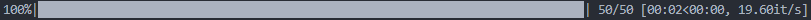

# tqdm

## Basic concepts of tqdm

* Wraps and replaces the original iterable object, automatically displaying a progress bar
* Customized messages can be set
* You can also control the progress of the progress bar

## basic usage

```python
from time import sleep
from faker import Faker  # dataset

f = Faker("en-us")
alist = [f.name() for _ in range(50)]

# Importing tqdm modules
from tqdm import tqdm, trange
```

Implementing a progress bar with trange

```
# use tqdm
p = 1
for i in tqdm(range(50)):  
    sleep(0.05)
```

```
# use trange
p = 1
for i in trange(50):  
    sleep(0.05)

```



change the maximum value of the iteration

```
p = 1
for i in trange(100):  
    sleep(0.05)
```


## Setting the progress bar information

```
# Information in process
proc_bar = tqdm(range(50))
p = 1
for i in proc_bar:
    proc_bar.set_description(f"computing:{i=:02d}") # Setting the leading information
    sleep(0.05)
```


```
# Display Information
proc_bar = tqdm(alist)
for name in proc_bar:
    proc_bar.set_postfix({"Processing":f"{name}"})
    sleep(0.05)
```


